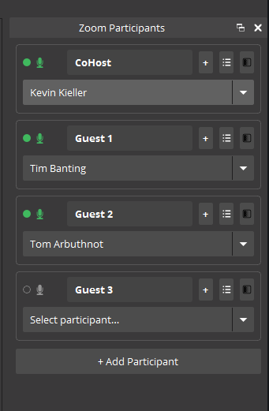

# Feeds

**Pull individual Zoom participant video feeds directly into OBS Studio as dedicated sources.**

https://github.com/user-attachments/assets/afe838b2-f571-47ee-a9d1-389b3247d3ed

Feeds is a native Windows plugin for OBS Studio that uses the Zoom Meeting SDK to give broadcasters clean, isolated video feeds from each Zoom participant. No screen capturing, no grid layouts, just raw high-quality video piped directly into your OBS scene.

---

## Requirements

- Windows 10 or later (64-bit)
- OBS Studio 32 or later
- A Zoom account (Pro or higher recommended)
- The Zoom meeting host must approve the livestream request when prompted

---

## Installation

Download the latest **Feeds.exe** from the [Releases](https://github.com/LetsDoVideo/feeds/releases) page
   - Run the installation file

or

Download the latest **Feeds.zip** from the [Releases](https://github.com/LetsDoVideo/feeds/releases) page
   - Extract the ZIP file
   - Copy the extracted contents into your OBS Studio root folder
   - For standard OBS installs: `C:\Program Files\obs-studio\`
   - For portable OBS installs: your portable OBS root folder

---

## Quick Start

1. In OBS, click **+** in the Sources panel and add a **Feeds Participant** source
2. In the source Properties window, click **Not logged in to Zoom. Click to Login.** — a browser window opens for you to sign in to your Zoom account, then return to OBS
3. Once logged in, click **Logged in. Click to Connect to Zoom Meeting.**
4. Enter your Zoom meeting number or link when prompted
5. Enter the meeting password if required
6. The host will see a **"Request to livestream"** popup in Zoom. Have them click **Allow**
7. Once connected, select a participant from the dropdown to display their feed
8. Add additional **Feeds Participant** sources for more feeds
9. Add a **Feeds Screenshare** source to capture active screenshares

> **Note:** When the plugin connects, the Zoom client will open on your desktop. This is expected and useful. Place it on a secondary monitor to keep an eye on all meeting participants, including those not currently in your OBS scene. Audio from the Zoom meeting will automatically appear in OBS as Desktop Audio, ready to use in your stream or recording.

---

## The Feeds Controls Dock (highly recommended)

Feeds includes a **Feeds Controls** dock that turns the plugin into a real production surface. Once you use it, you won't want to run Feeds without it.

To open it: in OBS, go to **Docks → Feeds Controls** and dock it wherever suits your layout.

From the dock you can:

- **Log in and connect** to a Zoom meeting in one place, with clear connection status
- **See every participant** in the meeting at a glance and assign them to sources
- **Manage your feeds** without hunting through individual source Properties windows

There is also a separate **Feeds Chat** dock (see below) for live chat.

If you do nothing else, open the Feeds Controls dock — it's the fastest way to run a multi-participant production.

---

## Feeds Chat

Feeds brings your live stream chat into OBS alongside your Zoom feeds — **Zoom, YouTube, and Twitch chat in one place**, with no extra apps or browser windows to babysit.

- **Feeds Chat dock** — all three platforms' messages in one unified dock, each tagged by platform *(Basic tier and up)*
- **Feeds Chat Popup** — click any message to feature it on stream *(Streamer tier and up)*
- **Feeds Chat Overlay** — a scrolling on-stream chat overlay, filterable by platform *(Streamer tier and up)*

To set it up: open **Docks → Feeds Chat**, then enter your YouTube channel and/or Twitch channel in the dock header. Zoom chat appears automatically once you're in a meeting.

> **About chat:** You can send messages to your **Zoom** chat directly from the Feeds Chat dock. YouTube and Twitch chat are **receive-only** — monitor them and feature them on stream, but replies happen in your usual chat tools.

---

## Screenshots

---

## Source Types

| Source | Description | Tier |
|--------|-------------|------|
| **Feeds Participant** | Captures an individual participant's camera feed | Free+ |
| **Feeds Screenshare** | Captures whatever is being shared on screen | Basic+ |
| **Feeds Chat Overlay** | On-stream scrolling chat overlay (Zoom/YouTube/Twitch) | Streamer+ |
| **Feeds Chat Popup** | Feature a single chat message on stream | Streamer+ |

### Special Options
- **[Active Speaker]** — a participant source can automatically follow whoever is currently talking

---

## ISO Recording

On **Basic tier and up**, Feeds can record isolated source recordings, giving you clean per-source footage to work with in post. *(Local ISO Source Recording — see your tier below.)*

---

## Tiers

| Tier | Price | Feeds | Resolution | Highlights |
|------|-------|-------|------------|------------|
| **Free** | Free | 1 | 720p | Active Speaker feed, full OBS integration, unlimited duration |
| **Basic** | $9.99/user/mo | 3 | 1080p | Screenshare, ISO recording, Feeds Chat dock, priority email support |
| **Streamer** | $24.99/user/mo | 5 | 1080p | Chat overlay + message popup, scene collection starter pack |
| **Broadcaster** | $79.99/user/mo | 8 | 1080p | Dedicated Discord channel, highest-priority SLA, consulting discount |

*Save up to 21% with annual billing. Pricing and subscriptions are managed through the Zoom Marketplace.*

To upgrade, click the upgrade prompt inside Feeds, or visit [letsdovideo.com/feeds-upgrade](https://letsdovideo.com/feeds-upgrade).

---

## Networks & Firewalls

Feeds works out of the box on most networks. On managed or restricted networks (common in libraries, schools, and corporate environments), a firewall or content filter may block the connections Feeds needs, causing login to fail or a paid plan to appear as Free.

If you see a "couldn't reach the login server" or "couldn't reach the licensing server" message, share the [Feeds Network Requirements](https://letsdovideo.com/feeds-network/) page with your IT team — it lists exactly what to allow.

---

## Known Limitations

- **Windows only** in this release (macOS coming in a future version)
- The meeting host must click **Allow** when prompted with the livestream request. Without host approval the plugin cannot access video feeds
- **YouTube and Twitch chat are receive-only.** You can send to Zoom chat from Feeds, but not to YouTube or Twitch

---

## Known Issues

**No current known issues. Please let us know if you experience any.**

---

## Troubleshooting

**Participant list is empty after connecting**

- Click the **Refresh Participant List** button in the source Properties window, or check the Feeds Controls dock.

**Black screen / 0x0 pixels on a source**

- Delete the source and re-add it after connecting to the meeting.

**The host saw a "Request to livestream" popup. Is that normal?**

- Yes. Click Allow. This is how the plugin accesses raw video feeds via the Zoom SDK.

**Login fails, or my paid plan shows as Free, on a work/school/library network**

- Your network may be blocking Feeds. See [Feeds Network Requirements](https://letsdovideo.com/feeds-network/) and share it with your IT team.

**How do I update the plugin?**

- Download the latest release from the [Releases](https://github.com/LetsDoVideo/feeds/releases) page and run the install exe, or use the zip to replace the existing files in your OBS folder.

---

## Support

- 📖 [Documentation](https://letsdovideo.com/feeds-documentation/)
- 🛠️ [Support Page](https://letsdovideo.com/feeds-support/)
- 💬 [Let's Do Video Discord](https://discord.com/invite/CXGwwKt)

---

## Legal

Feeds is an independent integration and is not officially endorsed by the OBS Project or Zoom Communications, Inc.
OBS Studio is a trademark of the OBS Project. Zoom is a trademark of Zoom Communications, Inc.

© 2026 Let's Do Video. Licensed under GPL-2.0.
